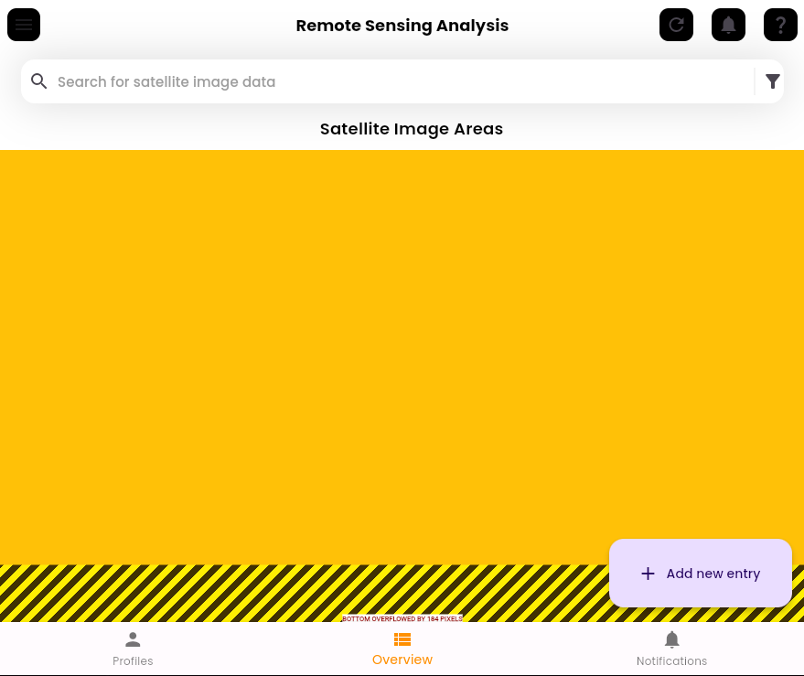
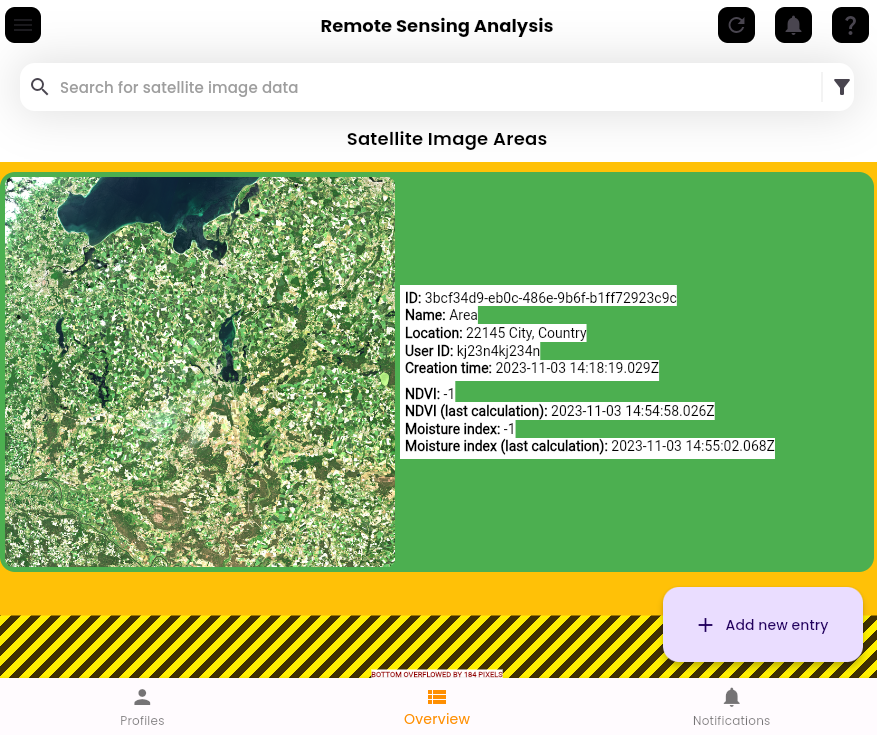

# Drought Early Warning System's Datahub (DE-DH)

# Guide
## Start DE-DH
1. Install `Docker` using the [official installation guide](https://docs.docker.com/engine/install/).
2. Install `Docker Compose` using the [official installation guide](https://docs.docker.com/compose/install/).
3. Start a terminal.
4. Change directory to the root of the project (_e.g. `cd  ~/Git/drought-ews`_).
5. Build the Docker containers by executing `sudo docker-compose up --build`.
6. If you have already build the Docker containers you can start them by executing `sudo docker-compose up` (_starts in foreground_) or `sudo docker-compose up -d` (_starts in background_) in the future.
   - This command will launch the Python backend, the Firebase Emulator Suite and the Flutter web app. 

## GUI
1. Once all three containers are up you can visit the Flutter web app at [http://172.19.0.4:8080/](http://172.19.0.4:8080/).

2. See the section ["Satellite images"](#satellite-images) to download a satellite image dataset.
3. In the GUI click on `Add new entry` to upload the downloaded satellite image data.
   - The upload can tak a few seconds. Please be patient! 
4. Fill out the form and save your input.
   - The calculation in the backend are taking time. 
5. If the backend calculated all the indexes you will see a new entry pop up. In case no entry is shown please click on the refresh icon in the top-right corner.

# Satellite images
## Supported satellite images
- **Source:** [Copernicus Open Access Hub](https://scihub.copernicus.eu/dhus/#/home)
- **Mission:** `Sentinel-2`
- **Satellite Platform:** `S2B_*`

### How to download satellite image data manually
For a video tutorial see this [YouTube video](https://www.youtube.com/watch?v=sMax7wkUrlI).
1. Open [Copernicus Open Access Hub](https://scihub.copernicus.eu/dhus/#/home).
2. Login with your account or register first.
3. Select the selection tool on the right side.
4. Select your desired area on the map.
5. Click on the top left on the burger menu to open the advanced search.
6. Fill out the "Sensing Period" (_e.g. 2023/07/01 - 2023/07/10_).
7. Leave "Ingestion Period" empty!
8. Select "Mission: Sentinel-2".
9. Select "Satellite Platform" with value "S2B_*".
10. Fill out "Cloud Cover" with the value "[0 TO 9.4]".
11. Click on the magnifier button.
12. Download any product that you want by clicking the download button.

# More information
## Backend testing
- `cd backend/tests`
- `python -m unittest testClassName`

## Config file
Configs are saved in the config Python file (`config.py`).