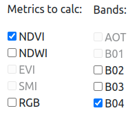
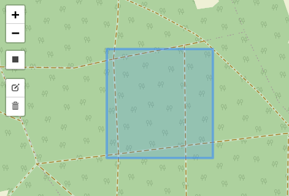
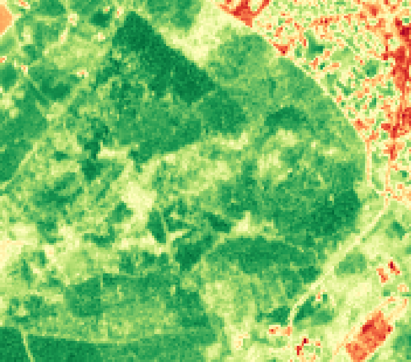
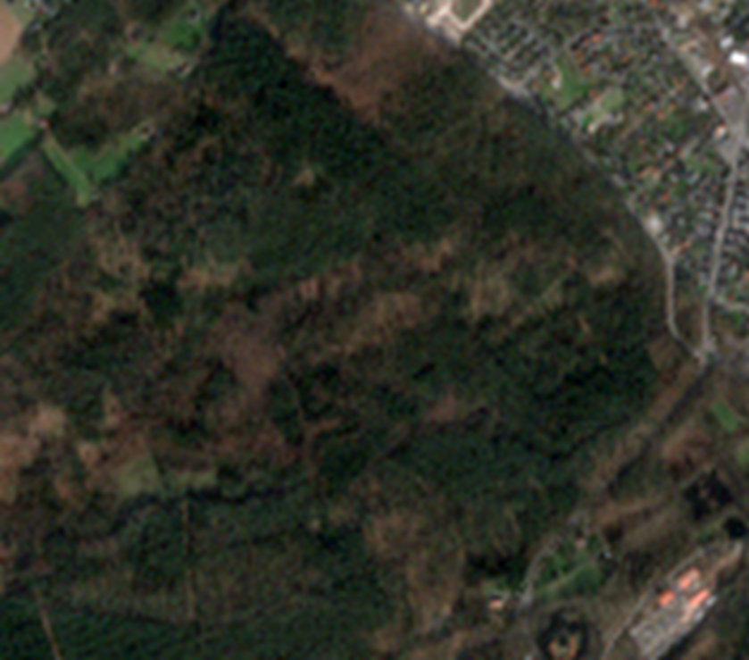

# DEWS's DataHub (Drought Early Warning System's DataHub)
DEWS's DataHub was made to import satellite data images from archives downloaded from e.g. [Copernicus Browser](https://browser.dataspace.copernicus.eu/). It is also possible to use the Sentinel Hub API to request satellite data images. The main goal is to have an overview over your satellite data as well as a PostGIS database to connect with other software.

The satellite mission, product type, thumbnail, etc. will be automatically recognized and displayed in a new entry in the [SatData overview tab](http://0.0.0.0/sat_data/overview/). When the archive contains satellite images that are raster compatible they will be converted into rasters and imported into the PostGIS database (*located at [0.0.0.0:5432](http://0.0.0.0:5432)*).

## Environment
- **Frontend:** HTML, CSS, JS (*realized with Django Template Language*)
- **Backend:** Python + Django Framework
- **Database:** PostGIS
- **Webserver:** Gunicorn + Nginx

# Guide
This guide shows how to start the Docker containers locally, how to use the web app, gives information about the PostGIS database, how to use with QGIS and which satellite datasets are supported.

## Create `.env` file
The `.env` file contains environment variables for the Python Django and the PostGIS environment.<br>
Copy the env file using `cp .env.example .env`.

The `.env.example` file is used as a template. For development purposes you do not need to modify `.env`'s content.

### Production
For **production** it is <b><u>not</u> recommended</b> to leave the `.env` file unmodified!<br>
Please create a Django secret key using this script
```python
from django.core.management.utils import get_random_secret_key  
print(get_random_secret_key())
```
or instead use this [website](https://djecrety.ir/).

The `.env` should look like the following code snippet. Please read the file carefully as the comments speak for themselves!<br>

The **Sentinel Hub API key** can be created at [Sentinel Hub Dashboard - Account Settings](https://apps.sentinel-hub.com/dashboard/#/account/settings). Here you should create a new "OAuth client".
```bash
# Settings.py
SECRET_KEY="secret_key_123"  # TODO: Modify on production!
DEBUG=False  # TODO: Modify! (True: development, False: production)

# Create super user
DJANGO_SUPERUSER_USERNAME="dews"  # Forbidden: Do not modify!
DJANGO_SUPERUSER_PASSWORD="dews"  # TODO: Modify on production!
DJANGO_SUPERUSER_EMAIL="dews@dews.de"  # Optional: Modify if needed

# Postgres
PGPASSWORD="dews"  # Optional: Modify if needed

# Sentinel API key
SENTINEL_HUB_API_KEY="key"  # TODO: Modify on production + development!
```


## Start Docker container
1. Install `Docker` using the [official installation guide](https://docs.docker.com/engine/install/).
2. Install `Docker Compose` using the [official installation guide](https://docs.docker.com/compose/install/).
3. *OPTIONAL:* Install `Docker BuildX`.
     - **Linux:** `apt install docker-buildx`
     - **MacOS:** `brew install docker-buildx` 
     - **Other OS:** [Docker BuildX installation guide](https://github.com/docker/buildx#installing).
     - **INFO:** *If you experience any issues while building the Docker containers please see this step as necessary!*
4. Start a terminal.
5. Change directory to the root of the project (_e.g. `cd  ~/Git/drought-ews`_).
6. Build the containers:
     - `docker-compose up -d --build`
     - **INFO:** *In case something went wrong please run `sudo rm -rf pgdata/` and try `docker-compose up -d --build --force-recreate`.*
7. If you already build the Docker containers just start them using this command:
     - `docker-compose up -d` 

## Monitor system activities
In the root of the repository a log file name `django.log` mirrors the system's log file in the Docker container. In case of an error or misbehaving you can investiage the problem using the log file.

If you want the contributors to take a look then you should make a copy of the file, create a GitHub issue, attach the `django.log` file and describe your problem in detail.

## Create satellite data entries
### Manual approach: Dataspace Copernicus
1. Open [Copernicus Browser](https://browser.dataspace.copernicus.eu/).
2. Log into your account.
3. Zoom to the area of your interest.
4. Selec the pentagon on the right side and then the rectangle or the pencil.
5. Draw an area around the area of your interest.
6. Select the tab `Search` on the left side panel.
7. Select the satellite mission and the product type of your desire.
    - *e.g Sentinel-2 -> MSI -> L2A*
8. It is recommended to recude the cloud coverage to maximum 10%.
9. Choose the time range of your desire.
    - *e.g. 2023-11-01 - 2023-11-08*
10. Click on search.
11. Hover over an entry and a green area is shown on the map which the hovered dataset will represent.
12. Select the entry of your desire and download it using the download button in the bottom right corner of the entry.


#### Import via webpage
The archive you downloaded from the Datspae Copernicus can be imported manually via the webpage:
1. Open the ["DEWS DataHub - Dashboard"](http://0.0.0.0/).
2. Login with the default credentials `dews:dews`.
3. Visit the ["DEWS DataHub - Create SatData Entry"](http://0.0.0.0/sat_data/create/) view <u><b>or</b></u> click on the "Add Entry" button at ["DEWS DataHub - Data Overview"](http://0.0.0.0/sat_data/overview/) view.
4. Click on "Choose File" and choose the satellite data ZIP archive you want to upload.
5. Click on "Upload Archive" and wait.

After the import is finished an entry will be displayed in the ["DEWS DataHub - Data Overview"](http://0.0.0.0/sat_data/overview/) view. If raster compatible images exist in the archive the processing can take quite a bit of time.<br>
Please be patient! The process cannot be sped up since the official PostGIS script `raster2pgsql` is used which is already optimized for this kind of imports.
   
### Alternative approach: Import using Docker
An alternative to the manual approach is to upload your archive into the Docker container and then import it using a custom Django admin command:
1. Copy your local archive into the DEWS container's filesystem:
     - `docker cp <archive_path> dews:/dews/media/sat_data/archive/`
     - **Example:** `docker cp S1A_IW_GRDH_1SDV_20231116T053343_20231116T053408_051238_062E4B_84CA.SAFE.zip dews:/dews/media/sat_data/archive/`
2. Import your data into the database.
     1. Log into the DEWS container. 
        - `docker exec -it dews /bin/bash`
     2. Import your archive using the Django admin command `importdata`. 
        - `python manage.py importdata <archive_path> -m <sat_mission>`
        - **Example:** `python manage.py importdata /dews/media/sat_data/archive/S1A_IW_GRDH_1SDV_20231116T053343_20231116T053408_051238_062E4B_84CA.SAFE.zip -m sentinel-1a`

### Automatic approach: Sentinel Hub API
This is the easiest and fastest way to create new satellite date entries on the system. The Sentinel Hub API key in the `.env` file must be correctly set! Follow the instructions to request and import satellite data images via the API:
1. Open the ["DEWS DataHub - Create SatData Entry"](http://0.0.0.0/sat_data/create/) view.
2. Scroll down to "Request via API".
3. Select the desired mission.
4. Select the desired resolution.
   1. **INFO:** The shown bands depend on the resolution selected. Not all resolutions support all bands.
5. **OPTIONAL:** Select the metrics to calculate.
6. Select the desired bands.
   1. Not needed if metrics were already selected because the selection is linked between the metrics and the bands. 
   2. *Example:* If you click on "NDVI" the bands "B04" and "B08" are automatically selected.<br> 
   3. If a metric is selected and you need more bands, you still can add more bands by clicking the check boxes.
   4. A metric can not be calculated if you uncheck a automatically checked check box.
7. Choose the time range of your desire.
   - For example: *2023-11-01 - 2023-11-08*
   - If you need data for one day only the start and the date date should match (*e.g. 2024-04-01 - 2024-04-01*).
8. Select a bounding box on the map.
   1. Click on the rectangle below the plus and minus buttons.
   2. Select a bounding box which is smaller than 2500px * 2500px. This restriction is made by the Sentinel Hub API.
      1. If your bounding box is too big, the system will tell you.
      2. Then click on the "Edit" icon and rearrange your bounding box <u><b>or</b></u> click the "Trash" icon and delete the bounding box.
   3. *Example:*<br>
9. Submit the form.

## DataHub Web App
### Description
In the ["DEWS DataHub - Create SatData Entry"]([http](http://0.0.0.0/sat_data/upload/)) view you can upload official satellite dataset archives that were downloaded from the [Copernicus Browser](https://browser.dataspace.copernicus.eu/).

After you have [downloaded a satellite dataset](#manual-approach-dataspace-copernicus) and upload the ZIP archive <u><b>or</b></u> after you have [requested satellite data images via the API](#automatic-approach-sentinel-hub-api), the system will process the received data.

So far the system shows the following data:
   - Satellite mission
   - Product type
   - Product start time
   - Product stop time
   - Archive path in filesystem (*if available*)
     - *e.g. `/dews/media/sat_data/archive/<archive>`* 
   - Extracted archive path 
     - *e.g. `/dews/media/sat_data/extracted/<mission>/<archive_name>`*
   - Metadata files (*if available*)
     - `manifest.safe`, `MTD_*.xml`, `INSPIRE.xml` and/or `xfdumanifest.xml` (*if available*)
   - Thumbnail image (*if available*)
   - Band table names in PostGIS database
     - *e.g. `3ed72523-fa4c-447b-b5db-19020d17a7ce_b02_r10m`*
   - Calculated metrics
     - *e.g. NDVI, SMI, ...*

### Metrics calculation
Before the [Copernicus Browser](https://browser.dataspace.copernicus.eu/) had the feature to directly download the True Color, NDVI, SMI, SWIR, etc. layers by selecting a bounding box (*see this [Copernicus Browser example](https://browser.dataspace.copernicus.eu/?zoom=14&lat=53.56042&lng=10.00151&themeId=DEFAULT-THEME&visualizationUrl=https%3A%2F%2Fsh.dataspace.copernicus.eu%2Fogc%2Fwms%2Fa91f72b5-f393-4320-bc0f-990129bd9e63&datasetId=S2_L2A_CDAS&fromTime=2024-03-09T00%3A00%3A00.000Z&toTime=2024-03-09T23%3A59%3A59.999Z&layerId=1_TRUE_COLOR&demSource3D=%22MAPZEN%22&cloudCoverage=30&dateMode=SINGLE)*), the development of the "DEWS DataHub" begun. During the development [Copernicus Browser](https://browser.dataspace.copernicus.eu/) released its feature and put the metrics calculation of the DEWS-DH a little in the shade.

Still the calculation of several metrics is one of the main benefits of the server-side orientation DEWS-DH. 

For example to calculate the NDVI (Normalized Difference Vegetation Index), which measures the difference between near-infrared and red light to quantify vegetation health, the band 4 (*red*) and band 8 (*near-infrared*) are required.

The `.tiff` or `.jp2` files are loaded as datasets using the Python library `rasterio`. After that the mathematical equation $\frac{(NIR-Red)}{(NIR-Red)}/$ is applied and the result is turned into a plot image (*see Code: `dews/sat_data/services/metrics_calc.py`*). This procedure is applied for all indices that can be calculated.

Example of NDVI image:<br>


Since the Sentinel Hub API does not return a RGB image, it must be calculated by the system. In the context of the DEWS-DH RGB is considered as an index, too.

Example of RGB image:<br>


In the future development the result should be saved as `.tiff` or `.jp2` file.

### Satellite data aggregation
Satellite data entries with the same coordinates will be collected and saved to a TimeTravel object which you can find at the ["DEWS DataHub - Overview"](http://0.0.0.0/sat_data/overview/) view's TimeTravel tab.

In a TimeTravel entry you can see the observed area with details about the related SatData entries. The TimeTravel object is linked to the SatData object and vice versa. It is a One-To-Many relationship, so the TimeTravel entry can have multiple SatData entries.


## PostGIS
### PostGIS database
- **Location:** [0.0.0.0:5432](http://0.0.0.0:5432)
- Imported archive's images will be imported as a raster in an own table.
  - The name consists of the sat data id, the band (*e.g. B04 which stands for the red band*) and the range (*meters per pixel*), if available.
  - **Table name convention:** `<sat_data_id>_<band>` / `<sat_data_id>_<band>_<range>`
  - **Example table name:** `3ed72523-fa4c-447b-b5db-19020d17a7ce_b02_r10m`

### PostGIS Admin UI
A PostGIS Admin container `dews-db-gui` is started parallely to provide a graphical overview over the database.
   - Visit [http://0.0.0.0:5050/](http://0.0.0.0:5050/) to see the [PostGIS Admin](http://0.0.0.0:5050/) overview.
   - Use `dews@dews.de:dews` as credentials.


## QGIS
### Import bands/raster from DEWS-DH into QGIS
1. Visit the ["DEWS DataHub - Dashboard"](http://0.0.0.0/sat_data/overview/) view.
2. Select a satellite data entry whose bands/raster you want to import into QGIS.
3. Scroll down to the section `Band Tables`.
4. Copy the table name containing the raster you want to import.
    - *e.g. `3ed72523-fa4c-447b-b5db-19020d17a7ce_b02_r10m`* 
5. Open QGIS.
6. Select `Layer` > `Add Layer` > `Add Raster Layer`.
7. Select `PostgreSQL` on the left side panel.
9. Add the `PostGIS` database.
    - **Database:** `dews`
    - **User:** `dews`
    - **Password:** `dews`  
10. You can use the `Search options` option in the bottom and copy the copied table name <u><b>or</b></u> search the table manually.   
    - **INFO:** All tables are located in the `public` schema!

## Supported satellite data sources
### Copernicus Browser (Dataspace Copernicus)
- **Link:** [Copernicus Browser](https://browser.dataspace.copernicus.eu/)
  
| Satellite Type | Instrument | Data Level      | Archive Naming Convention             | Support Status | Additional Info                                                                    |
| -------------- | ---------- | --------------- | ------------------------------------- | -------------- | ---------------------------------------------------------------------------------- |
| Sentinel-1A    | C-SAR      | Level-0 RAW     | `S1A_IW_RAW_0SDV_(...).SAFE.zip`      | ✅              |                                                                                    |
|                |            | Level-1 SLC     | `S1A_IW_SLC__1SDV_(...).SAFE.zip`     | ✅              |                                                                                    |
|                |            | Level-1 GRD     | `S1A_S1A_IW_GRDH_1SDV_(...).SAFE.zip` | ✅              |                                                                                    |
|                |            | Level-1 GRD COG | `S1A_IW_GRDH_1SDV_(...).SAFE.zip`     | ✅              | `.dat` files                                                                       |
|                |            | Level-2 OCN     | `S1A_IW_OCN_2SDV_(...).SAFE.zip`      | ✅              | `.nc` files                                                                        |
| Sentinel-1B    |            |                 | ❓                                     | ❌              | No data found at [Copernicus Browser](https://browser.dataspace.copernicus.eu/). |

| Satellite Type | Instrument | Data Level | Archive Naming Convention   | Support Status | Additional Info |
| -------------- | ---------- | ---------- | --------------------------- | -------------- | --------------- |
| Sentinel-2A    | MSI L1C    |            | `S2A_MSIL1C_(...).SAFE.zip` | ✅              |                 |
|                | MSI L2A    |            | `S2A_MSIL2A_(...).SAFE.zip` | ✅              |                 |
| Sentinel-2B    | MSI L1C    |            | `S2B_MSIL1C_(...).SAFE.zip` | ✅              |                 |
|                | MSI L2A    |            | `S2B_MSIL2A_(...).SAFE.zip` | ✅              |                 |

| Satellite Type | Instrument | Data Level     | Archive Naming Convention           | Support Status | Additional Info                                                                    |
| -------------- | ---------- | -------------- | ----------------------------------- | -------------- | ---------------------------------------------------------------------------------- |
| Sentinel-3A    | OLCI       | Level-1 EFR    | `S3A_OL_1_EFR____(...).SEN3.zip`    | ✅              | `.nc` files                                                                        |
|                |            | Level-1 ERR    | `S3A_OL_1_ERR____(...).SEN3.zip`    | ✅              | `.nc` files                                                                        |
|                |            | Level-2 LFR    | `S3A_OL_2_LFR____(...).SEN3.zip`    | ✅              | `.nc` files                                                                        |
|                |            | Level-2 LRR    | `S3A_OL_2_LRR____(...).SEN3.zip`    | ✅              | `.nc` files                                                                        |
|                |            | Level-2 WFR    | `S3A_OL_2_WFR____(...).SEN3.zip`    | ✅              | `.nc` files                                                                        |
|                |            | Level-2 WRR    | `S3A_OL_2_WRR____(...).SEN3.zip`    | ✅              | `.nc` files                                                                        |
|                | SRAL       | Level-1 SRA    | ❓                                   | ❌              | No data found at [Copernicus Browser](https://browser.dataspace.copernicus.eu/). |
|                |            | Level-1 SRA_A  | ❓                                   | ❌              | No data found at [Copernicus Browser](https://browser.dataspace.copernicus.eu/). |
|                |            | Level-1 SRA_BS | ❓                                   | ❌              | No data found at [Copernicus Browser](https://browser.dataspace.copernicus.eu/). |
|                |            | Level-2 LAN    | ❓                                   | ❌              | No data found at [Copernicus Browser](https://browser.dataspace.copernicus.eu/). |
|                |            | Level-2 WAT    | ❓                                   | ❌              | No data found at [Copernicus Browser](https://browser.dataspace.copernicus.eu/). |
|                |            | Level-2 LAN_HY | ❓                                   | ❌              | No data found at [Copernicus Browser](https://browser.dataspace.copernicus.eu/). |
|                |            | Level-2 LAN_SI | ❓                                   | ❌              | No data found at [Copernicus Browser](https://browser.dataspace.copernicus.eu/). |
|                |            | Level-2 LAN_LI | ❓                                   | ❌              | No data found at [Copernicus Browser](https://browser.dataspace.copernicus.eu/). |
|                | SLSTR      | Level-1 RBT    | `S3A_SL_1_RBT____(...).SEN3.zip`    | ✅              | `.nc` files                                                                        |
|                |            | Level-2 AOD    | `S3A_SL_2_AOD____(...).SEN3.zip`    | ✅              | `.nc` files                                                                        |
|                |            | Level-2 FRP    | `S3A_SL_2_FRP____(...).SEN3.zip`    | ✅              | `.nc` files                                                                        |
|                |            | Level-2 LST    | `S3A_SL_2_LST____(...).SEN3.zip`    | ✅              | `.nc` files                                                                        |
|                |            | Level-2 WST    | `S3A_SL_2_WST____(...).SEN3.zip`    | ✅              | `.nc` files                                                                        |
|                | SYNERGY    | Level-2 SY_SYN | `S3A_SY_2_SYN____(...).SEN3.zip`    | ✅              | `.nc` files                                                                        |
|                |            | Level-2 SY_V10 | `S3A_SY_2_V10____(...).SEN3.zip`    | ✅              | `.nc` files                                                                        |
|                |            | Level-2 SY_VGP | `S3A_SY_2_VGP____(...).SEN3.zip`    | ✅              | `.nc` files                                                                        |
| Sentinel-3B    | AOD        |                | `S3B_SY_2_AOD____(...).SEN3.zip`    | ✅              | `.nc` files                                                                        |
|                | AUX        |                | `S3B_SR___ROE_AX____(...).SEN3.zip` | ✅              | `.nc` files                                                                        |
|                | OLCI       | Level-1 ERR    | `S3B_OL_1_ERR____(...).SEN3.zip`    | ✅              | `.nc` files                                                                        |
|                | SLSTR      | Level-2 LST    | `S3B_SL_2_LST____(...).SEN3.zip`    | ✅              | `.nc` files                                                                        |
|                | SYNERGY    | Level-2-SY-VG1 | `S3B_SY_2_VG1____(...).SEN3.zip`    | ✅              | `.nc` files                                                                        |
|                |            | Level-2-SY-VGP | `S3B_SY_2_VGP____(...).SEN3.zip`    | ✅              | `.nc` files                                                                        |


| Satellite Type | Instrument | Data Level | Archive Naming Convention | Support Status | Additional Info                                                                                        |
| -------------- | ---------- | ---------- | ------------------------- | -------------- | ------------------------------------------------------------------------------------------------------ |
| Sentinel-5P    |            |            | ❓                         | ❌              | Work in progress, but no priority yet because this satellite's main observation goal is air pollution. |

| Satellite Type | Instrument | Data Level | Archive Naming Convention | Support Status | Additional Info                                                                    |
| -------------- | ---------- | ---------- | ------------------------- | -------------- | ---------------------------------------------------------------------------------- |
| Sentinel-6     |            |            | ❓                         | ❌              | Not available at [Copernicus Browser](https://browser.dataspace.copernicus.eu/). |
