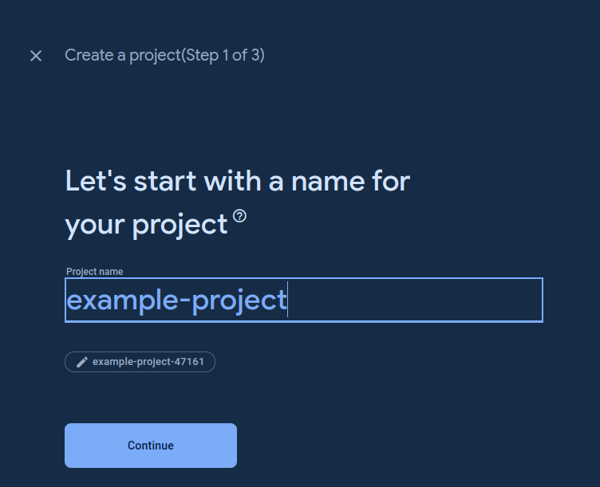
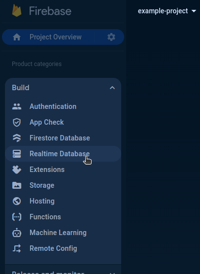
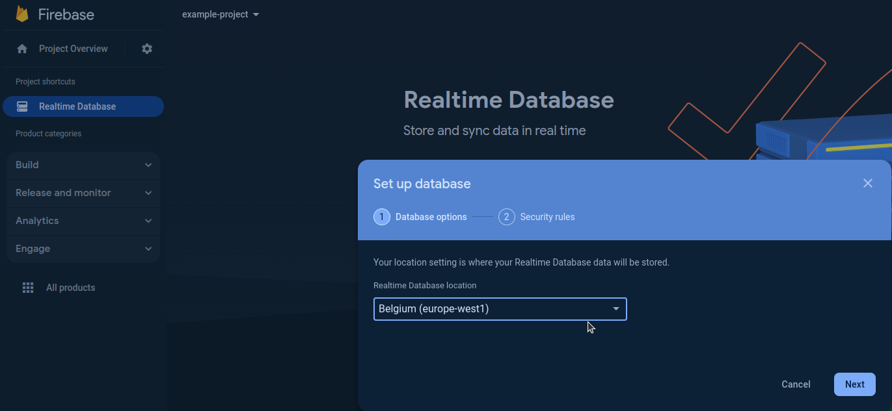
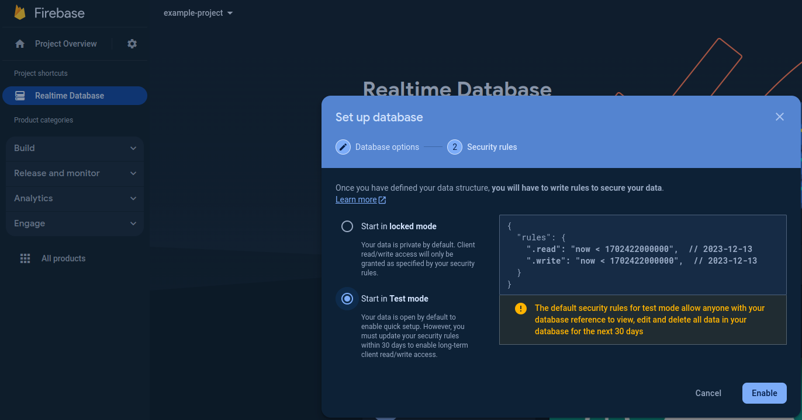
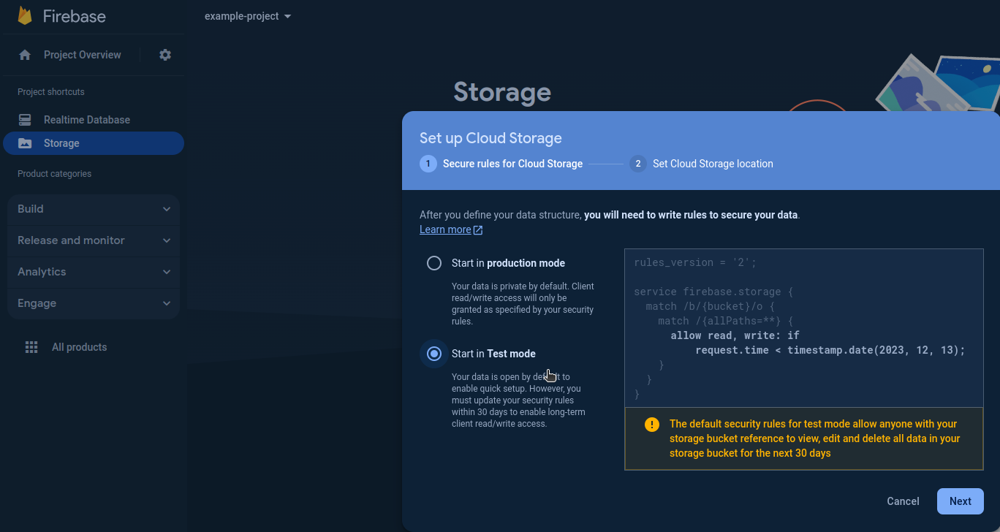
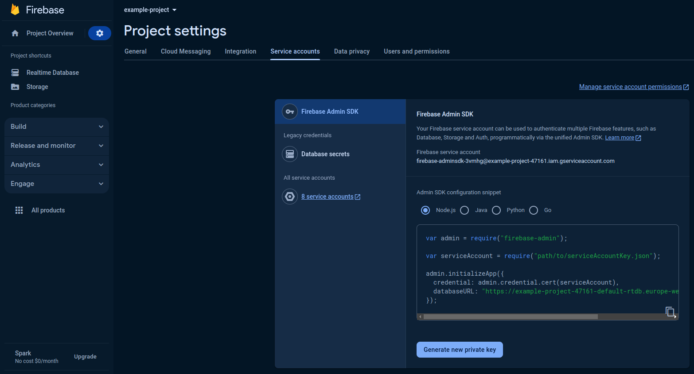
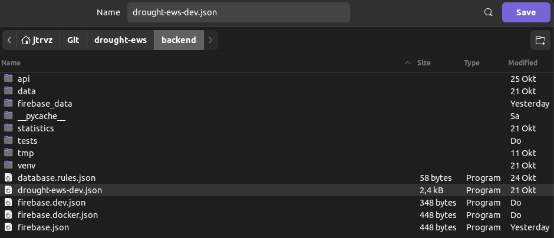
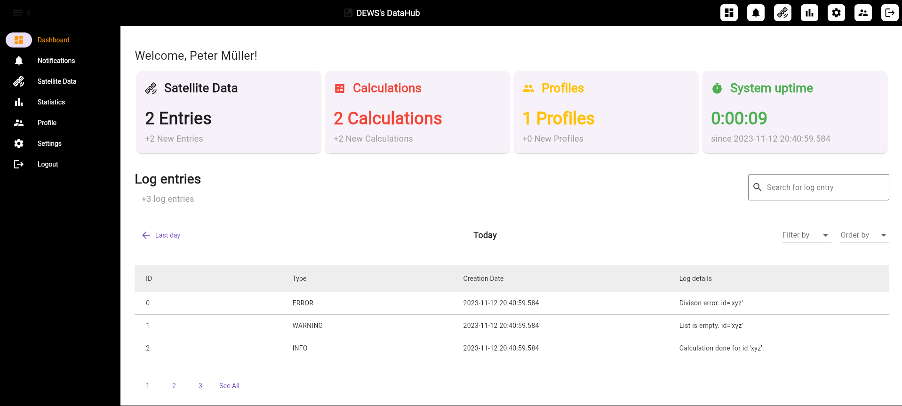
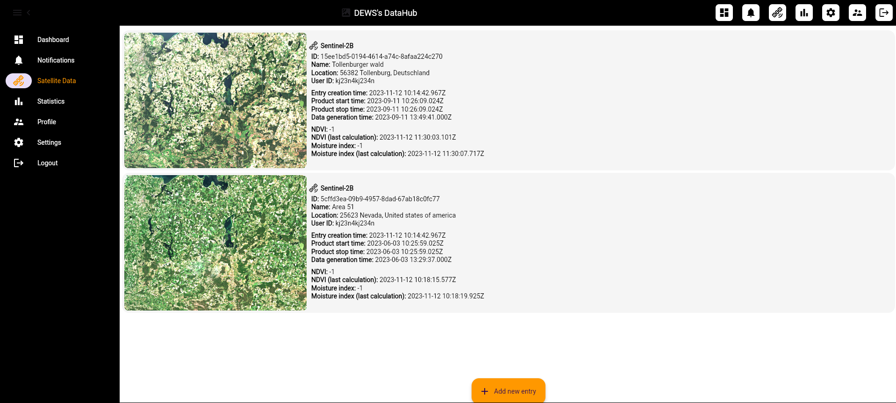
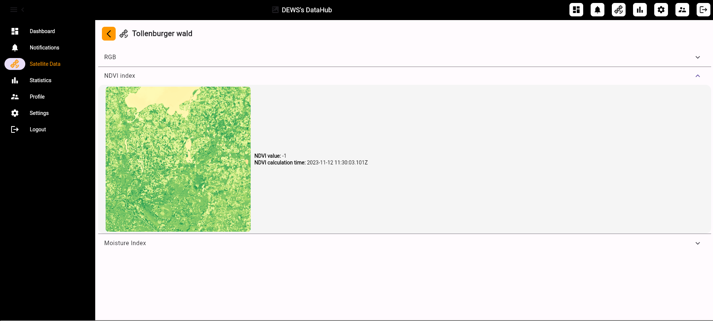

# DEWS's DataHub (Drought Early Warning System's DataHub)

# Guide
This guide shows how to create Firebase project, start the Docker container locally and how to use the web app.

## Create the Firebase Project
1. Visit the [Firebase Console](https://console.firebase.google.com/).
   
2. Create a new project called `drought-ews-dev`. \
 \
ℹ️ **INFO:** Please stay with the exact name `drought-ews-dev`. For demonstration purpose I had to create a new project with another name.
1. Deactivate Google Analytics and create the project. \
 

3. Click on `Build` on the left navigation bar and then on `Realtime Database`. \
 \
A new project shortcut called `Realtime Database` appears below `Project Overview`.

4. Click on the project shortcut `Realtime Database` and create a database. Use the **test mode rules**. \
 \

5. Do the same steps 3 and 4 for `Storage` and create a new storage bucket. Use the **test mode rules**. \
 \
 

1. Go to the `Project settings` by clicking the settings wheel next to the `Project Overview` button.
2. Go to the tab `Service accounts`.
3. Click on `Generate new private key` on the bottom. \

1. Rename the JSON file to `drought-ews-dev.json` and save it in the `backend/` directory of this project. \
 

## Start DEWS's DataHub
1. Install `Docker` using the [official installation guide](https://docs.docker.com/engine/install/).
2. Install `Docker Compose` using the [official installation guide](https://docs.docker.com/compose/install/).
3. Install `Docker BuildX`.
    - **Linux:** `apt install docker-buildx`
    - **MacOS:** `brew install docker-buildx` 
    - *For other operating systems please see the [Docker BuildX installation guide](https://github.com/docker/buildx#installing).*
4. Download the necessary Firebase Emulators data from [HAW Hamburg's OneDrive](https://hawhamburgedu-my.sharepoint.com/:u:/g/personal/wja999_haw-hamburg_de/ESmPOEhFQ3FIu2bCs3cOwuIB1Cn1hlBHeI-wXqGBrOmONQ?e=uj6Vr7) to this project's `backend/` directory.
    - ℹ️ **INFO:** Only members of the HAW Hamburg can download this file!
5. Start a terminal.
6. Change directory to the root of the project (_e.g. `cd  ~/Git/drought-ews`_).
7. Unzip `backend/firebase_data.zip` to `backend/firebase_data`.
    - **Linux:** `unzip backend/firebase_data.zip -d backend/.`
    - **MacOS:** `unzip backend/firebase_data.zip -d backend/.`
8. Build the Docker containers by executing `sudo docker-compose up --build`.
    - ℹ️ **INFO:** The building process can take quite a long time. Please be patient!
9.  If you have already build the Docker containers you can start them by executing `sudo docker-compose up` (_starts in foreground_) or `sudo docker-compose up -d` (_starts in background_).
    - ℹ️ **INFO:** This command will launch the Python backend, the Firebase Emulator Suite and the Flutter web app using Docker container.

## DataHub Web App
### Description
On the data hub's web app you can upload official ZIP archives that were downloaded from a [supported satellite data source](#supported-satellite-data-sources) (*e.g. Dataspace Copernicus*)

After you have downloaded a satellite dataset you can upload the ZIP archive and let the system process the data.

So far the system generates the following data:
- 🖼️ **RGB image**
  - *stacked RED, GREEN and BLUE band*
  - *brightend, gamma corrected and normalized*
- 🌳 **Normalized Difference Vegetation Index (NDVI)**
  - *(VNIR - RED) / (VNIR + RED)*
- 💧 **Moisture index**
  - *(VNIR - SWIR) / (VNIR + SWIR)*
- 🌿 **Enhanced Vegetation Index (EVI)** 
  - ⚠️ *not displayed yet*
  - *(NIR - RED) / (NIR + C1 * RED - C2 * BLUE + L)*
- 💦 **Normalized Difference Water Index (NDWI)**
  - ⚠️ *not displayed yet*
  - *(GREEN - VNIR) / (GREEN + VNIR)*
- ❄️ **Normalized Difference Snow Index (NDSI)**
  - ⚠️ *not displayed yet*
  - *(GREEN - SWIR) / (GREEN + SWIR)*

### Use cases
The following use cases show how a user should interact with the system. \
Please read and follow the guide ["Start DEWS's DataHub"](#start-dewss-datahub) beforehand.

#### Open dashboard
1. Visit the Flutter web app at [http://172.19.0.4/](http://172.19.0.4/).
2. You will see a dashboard about events that happened since your last login. \

#### View satellite data
1. Visit the Flutter web app at [http://172.19.0.4/](http://172.19.0.4/).
2. Click on the navigation item `Satellite Data` to look at already uploaded satellite datasets. \

3. If you want to see more details about a dataset click on an entry. \

4. Clicking on `RGB`, `NDVI`, etc. will open an expansion with more details about the selected topic. 
5. You can return to the `Satellite data` main page by clicking the left arrow in the top left corner. 

#### Upload a satellite dataset
1. Visit the Flutter web app at [http://172.19.0.4/](http://172.19.0.4/).
2. Click on the navigation item `Satellite Data`. \

3. If you want to add a new satellite dataset click on `Add new entry` on the bottom of the screen. \

   - Select a ZIP archive file, fill out the form, select the satellite type and click on save. 
   - ℹ️ **INFO:** The upload and calculation can take a few seconds. Please be patient! 
1. If the backend calculated all the indexes you will see a new entry pop up. In case no entry is shown please press the `F5` key and/or click on the navigation item `Satellite Data` to refresh the page.

# Satellite images
## Supported satellite data sources
### Dataspace Copernicus
| Satellite Type | Instrument | Data Level      | Archive Naming Convention             | Support Status | Additional Info                                                                    |
| -------------- | ---------- | --------------- | ------------------------------------- | -------------- | ---------------------------------------------------------------------------------- |
| Sentinel-1A    | C-SAR      | Level-0 RAW     | `S1A_IW_RAW_0SDV_(...).SAFE.zip`      | ❌ *(WIP)*      |                                                                                    |
|                |            | Level-1 SLC     | `S1A_IW_SLC__1SDV_(...).SAFE.zip`     | ❌ *(WIP)*      |                                                                                    |
|                |            | Level-1 GRD     | `S1A_S1A_IW_GRDH_1SDV_(...).SAFE.zip` | ❌ *(WIP)*      |                                                                                    |
|                |            | Level-1 GRD COG | `S1A_IW_GRDH_1SDV_(...).SAFE.zip`     | ❌ *(WIP)*      | `.dat` files                                                                        |
|                |            | Level-2 OCN     | `S1A_IW_OCN_2SDV_(...).SAFE.zip`      | ❌ *(WIP)*      | `.nc` files                                                                        |
| Sentinel-1B    |            |                 | ❓                                     | ❌              | No data found at [Dataspace Copernicus](https://dataspace.copernicus.eu/browser/). |

| Satellite Type | Instrument | Data Level | Archive Naming Convention   | Support Status | Additional Info |
| -------------- | ---------- | ---------- | --------------------------- | -------------- | --------------- |
| Sentinel-2     | MSI L1C    |            | `S2B_MSIL1C_(...).SAFE.zip` | ❌ *(WIP)*      |                 |
|                | MSI L2A    |            | `S2B_MSIL2A_(...).SAFE.zip` | ✅              |                 |

| Satellite Type | Instrument | Data Level     | Archive Naming Convention        | Support Status | Additional Info                                                                    |
| -------------- | ---------- | -------------- | -------------------------------- | -------------- | ---------------------------------------------------------------------------------- |
| Sentinel-3     | OLCI       | Level-1 EFR    | `S3A_OL_1_EFR____(...).SEN3.zip` | ❌ *(WIP)*      | `.nc` files                                                                        |
|                |            | Level-1 ERR    | `S3A_OL_1_ERR____(...).SEN3.zip` | ❌ *(WIP)*      | `.nc` files                                                                        |
|                |            | Level-2 LFR    | `S3A_OL_2_LFR____(...).SEN3.zip` | ❌ *(WIP)*      | `.nc` files                                                                        |
|                |            | Level-2 LRR    | `S3A_OL_2_LRR____(...).SEN3.zip` | ❌ *(WIP)*      | `.nc` files                                                                        |
|                |            | Level-2 WFR    | `S3A_OL_2_WFR____(...).SEN3.zip` | ❌ *(WIP)*      | `.nc` files                                                                        |
|                |            | Level-2 WRR    | `S3A_OL_2_WRR____(...).SEN3.zip` | ❌ *(WIP)*      | `.nc` files                                                                        |
|                | SRAL       | Level-1 SRA    | ❓                                | ❌              | No data found at [Dataspace Copernicus](https://dataspace.copernicus.eu/browser/). |
|                |            | Level-1 SRA_A  | ❓                                | ❌              | No data found at [Dataspace Copernicus](https://dataspace.copernicus.eu/browser/). |
|                |            | Level-1 SRA_BS | ❓                                | ❌              | No data found at [Dataspace Copernicus](https://dataspace.copernicus.eu/browser/). |
|                |            | Level-2 LAN    | ❓                                | ❌              | No data found at [Dataspace Copernicus](https://dataspace.copernicus.eu/browser/). |
|                |            | Level-2 WAT    | ❓                                | ❌              | No data found at [Dataspace Copernicus](https://dataspace.copernicus.eu/browser/). |
|                |            | Level-2 LAN_HY | ❓                                | ❌              | No data found at [Dataspace Copernicus](https://dataspace.copernicus.eu/browser/). |
|                |            | Level-2 LAN_SI | ❓                                | ❌              | No data found at [Dataspace Copernicus](https://dataspace.copernicus.eu/browser/). |
|                |            | Level-2 LAN_LI | ❓                                | ❌              | No data found at [Dataspace Copernicus](https://dataspace.copernicus.eu/browser/). |
|                | SLSTR      | Level-1 RBT    | `S3A_SL_1_RBT____(...).SEN3.zip` | ❌ *(WIP)*      | `.nc` files                                                                        |
|                |            | Level-2 AOD    | `S3A_SL_2_AOD____(...).SEN3.zip` | ❌ *(WIP)*      | `.nc` files                                                                        |
|                |            | Level-2 FRP    | `S3A_SL_2_FRP____(...).SEN3.zip` | ❌ *(WIP)*      | `.nc` files                                                                        |
|                |            | Level-2 LST    | `S3A_SL_2_LST____(...).SEN3.zip` | ❌ *(WIP)*      | `.nc` files                                                                        |
|                |            | Level-2 WST    | `S3A_SL_2_WST____(...).SEN3.zip` | ❌ *(WIP)*      | `.nc` files                                                                        |
|                | SYNERGY    | Level-2 SY_AOD | `S3B_SY_2_AOD____(...).SEN3.zip` | ❌ *(WIP)*      | `.nc` files                                                                        |
|                |            | Level-2 SY_SYN | `S3B_SY_2_SYN____(...).SEN3.zip` | ❌ *(WIP)*      | `.nc` files                                                                        |
|                |            | Level-2 SY_V10 | `S3B_SY_2_V10____(...).SEN3.zip` | ❌ *(WIP)*      | `.nc` files                                                                        |
|                |            | Level-2 SY_VG1 | `S3B_SY_2_VG1____(...).SEN3.zip` | ❌ *(WIP)*      | `.nc` files                                                                        |
|                |            | Level-2 SY_VGP | `S3B_SY_2_VGP____(...).SEN3.zip` | ❌ *(WIP)*      | `.nc` files                                                                        |

| Satellite Type | Instrument | Data Level | Archive Naming Convention | Support Status | Additional Info                                                                                        |
| -------------- | ---------- | ---------- | ------------------------- | -------------- | ------------------------------------------------------------------------------------------------------ |
| Sentinel-5P    |            |            | ❓                         | ❌ *(WIP)*      | Work in progress, but no priority yet because this satellite's main observation goal is air pollution. |

| Satellite Type | Instrument | Data Level | Archive Naming Convention | Support Status | Additional Info                                                                    |
| -------------- | ---------- | ---------- | ------------------------- | -------------- | ---------------------------------------------------------------------------------- |
| Sentinel-6     |            |            | ❓                         | ❌              | Not available at [Dataspace Copernicus](https://dataspace.copernicus.eu/browser/). |

### EarthExplorer
- **Link:** [EarthExplorer](https://earthe
- xplorer.usgs.gov/)
- **Datasets:**
  - `Landsat 3` **Support status:** ❌ *(WIP)*
  - `Landsat 4` **Support status:** ❌ *(WIP)*
  - `Landsat 5` **Support status:** ❌ *(WIP)*
  - `Landsat 6` **Support status:** ❌ *(WIP)*
  - `Landsat 7` **Support status:** ❌ *(WIP)*
  - `Landsat 8` **Support status:** ❌ *(WIP)*

### How to download satellite image data manually
For a video tutorial see this [YouTube video](https://www.youtube.com/watch?v=sMax7wkUrlI).
1. Open [Dataspace Copernicus](https://dataspace.copernicus.eu/browser/).
2. Login with your account or register first.
3. Select the selection tool on the right side.
4. Select your desired area on the map.
5. Click on the top left on the burger menu to open the advanced search.
6. Fill out the "Sensing Period" (_e.g. 2023/07/01 - 2023/07/10_).
7. Leave "Ingestion Period" empty!
8. Select "Mission: Sentinel-2".
9. Select "Satellite Platform" with value "S2B_*".
10. Fill out "Cloud Cover" with the value "[0 TO 9.4]".
11. Click on the magnifier button.
12. Download any product that you want by clicking the download button.

# More information
## Backend testing
- `cd backend/tests`
- `python -m unittest testClassName`

## Config file
Configs are saved in the config Python file (`config.py`).