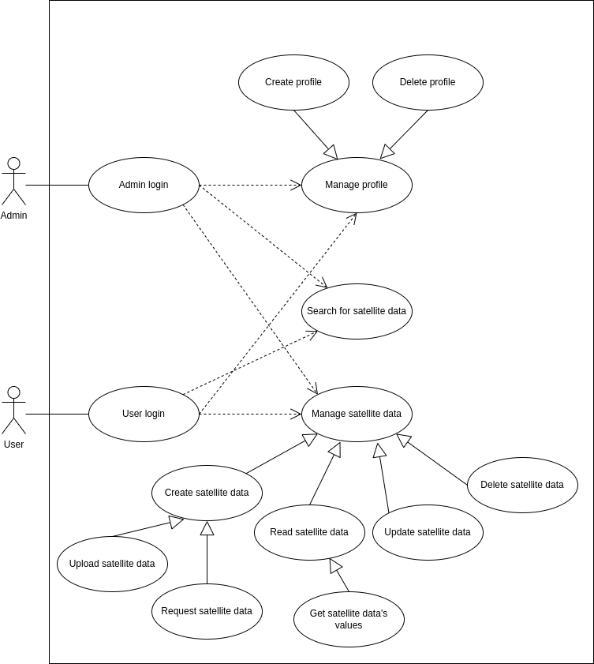

# Drought Early Warning System's Datahub (DE-DH)

**About arc42**\
*arc42, the template for documentation of software and system
architecture.*\
*Template Version 8.2 EN. (based upon AsciiDoc version), January 2023*\
*Created, maintained and © by Dr. Peter Hruschka, Dr. Gernot Starke and
contributors. See <https://arc42.org>.*

# 1. Introduction and Goals
This section introduces the task and outlines the objectives pursued by Drought Early Warning System's Datahub.

## 1.1. Requirements Overview
### What is the Drought Early Warning System's Datahub?
- Drought Early Warning System's Datahub (*short: DE-DH*) is a datahub for various satellite images and their computed values (*e.g. indexes*) aswell as relevant data (*e.g. weather data*).

### Essential features
- Returns data in modern common data formats.
- Supports data upload but also gets data by calling the satellite data APIs.
- Processes data from Sentinel- and Landsat-satellites.
- Automatically calculates indexes like NDVI, SWIR, NSWI, NDSI and moisture index.

## 1.2. Use-Cases

<table>
    <tr>
        <th>Number</th>
        <th>Use-case</th>
        <th>Explanation</th>
    </tr>
    <tr>
        <td>1</td>
        <td>
            Admin login
        </td>
        <td>
            Seperate login for admins.
        </td>
    </tr>
    <tr>
        <td>2</td>
        <td>
            User login
        </td>
        <td>
            Seperate login for regular users.
        </td>
    </tr>
    <tr>
        <td>3.1</td>
        <td>
            Manage profile (<i>regular user</i>)
        </td>
        <td>
            Create, read, update and delete own profile
        </td>
    </tr>
    <tr>
        <td>3.2</td>
        <td>
            Manage profile (<i>admin user</i>)
        </td>
        <td>
            Create, read, update and delete all profiles
        </td>
    </tr>
    <tr>
        <td>4.1</td>
        <td>
            Manage satellite data (<i>admin user</i>)
        </td>
        <td>
            Create, read, update and delete all satellite data
        </td>
    </tr>
    <tr>
        <td>4.2</td>
        <td>
            Manage satellite data (<i>admin user</i>)
        </td>
        <td>
            Create, read, update and delete own satellite data
        </td>
    </tr>
    <tr>
        <td>5.1</td>
        <td>
            Search for satellite data (<i>admin user</i>)
        </td>
        <td>
            Search for all satellite data
        </td>
    </tr>
    <tr>
        <td>5.1</td>
        <td>
            Search for satellite data (<i>admin user</i>)
        </td>
        <td>
            Search own satellite data
        </td>
    </tr>
</table>

## 1.3. Quality Goals
The following table describes the key quality objectives of DE-DH. The order of the goals gives you a rough idea of their importance.

<table>
  <tr>
    <th>Quality goal</th>
    <th>Motivation</th>
  </tr>
  <tr>
    <td>Functionality</td>
    <td>
      <ul>
        <li>Enable users to receive and process satellite data from various sources.</li>
        <li>Execute API calls to services like Copernicus and USGS for current satellite data retrieval.</li>
      </ul>
    </td>
  </tr>
  <tr>
    <td>Reliability</td>
    <td>
        <ul>
          <li>Ensure stable and reliable operation to maintain data processing accuracy.</li>
      </ul>
    </td>
  </tr>
  <tr>
    <td>Usability</td>
    <td>
        <ul>
          <li>Create a user-friendly interface for easy satellite data uploads.</li>
          <li>Provide clear documentation and training materials for user support.</li>
      </ul>
    </td>
  </tr>
  <tr>
    <td>Performance</td>
    <td>
        <ul>
            <li>Optimize data processing efficiency to reduce latency in data uploading and retrieval.</li>
            <li>Ensure scalability to accommodate growing data flow.</li>
      </ul>
    </td>
  </tr>
  <tr>
    <td>Security</td>
    <td>
        <ul>
            <li>Implement data encryption and access controls to protect uploaded and retrieved data.</li>
            <li></li>
      </ul>
    </td>
  </tr>
  <tr>
    <td>Interoperability</td>
    <td>
        <ul>
            <li>Support various data sources and formats to facilitate integration of satellite data from diverse providers.</li>
      </ul>
    </td>
  </tr>
  <tr>
    <td>Maintainability</td>
    <td>
        <ul>
            <li>Create a software solution that is easy to maintain, enabling updates, bug fixes, and extensions.</li>
      </ul>
    </td>
  </tr>
</table>

The [quality scenarios in section 10](#quality-scenarios) detail these goals and serve to evaluate their achievement.

## 1.3. Stakeholders
The following table illustrates the stakeholders of DE-DH and their respective intentions.

<table>
    <tr>
        <th>Role</th>
        <th>Expectations</th>
    </tr>
    <tr>
        <td>Developers</td>
        <td>
            <ul>
                <li>Clear and detailed technical requirements</li>
                <li>Timely resolution of issues and bugs</li>
                <li>Can be hosted on own machines</li>
                <li>API for integration into own projects</li>
                <li>Commonly used data formats (<i>e.g. JSON, TIFF, ...</i>)</li>
            </ul>
        </td>
    </tr>
    <tr>
        <td>Scientists</td>
        <td>
            <ul>
                <li>Access to reliable database</li>
                <li>Uncomplicated and easy data upload</li>
                <li>Easy data retrieval</li>
                <li>Fast calculations</li>
                <li>High-quality and accurate data</li>
                <li>(Support for custom data processing)</li>
            </ul>
        </td>
    </tr>
</table>

# 2. Constraints
At the beginning of the project various constraints had to be respected within the design of DE-DH. They still affect the solution. This section represents these restrictions and explains – where necessary – their motivations.

## 2.1. Technical constraints
<table>
    <tr>
        <th>Constraint</th>
        <th>Explanation/Motivation</th>
    </tr>
    <tr>
        <td>Moderate hardware equipment for development</td>
        <td>
            <ul>
                <li>Developer of the datahub has only access to a notebook with a AMD Ryzen 5 4500 U with 16 GB RAM.</li>
                <li>Operating DE-DH on a standard notebook in order to develop using the datahub.</li>
            </ul>
        </td>
    </tr>
    <tr>
        <td>Support of all common operating system</td>
        <td>
            <ul>
                <li>Since Windows, MacOS and Linux are the most used operating systems they should be supported.</li>
            </ul>
        </td>
    </tr>
    <tr>
        <td>Frontend implementation in Flutter/Dart</td>
        <td>
            <ul>
                <li>Flutter is useful for cross-platform development of GUIs.</li>
            </ul>
        </td>
    </tr>
    <tr>
        <td>Backend implementation in Python</td>
        <td>
            <ul>
                <li>Python is well-known for the use in machine-learning context and a wide range of libraries.</li>
            </ul>
        </td>
    </tr>
    <tr>
        <td>Data format compatibility</td>
        <td>
            <ul>
                <li>The satellite data may come in different formats (e.g., GeoTIFF, NetCDF).</li>
            </ul>
        </td>
    </tr>
    <tr>
        <td>Data volume and storage</td>
        <td>
            <ul>
                <li>Satellite imagery generates vast amounts of data.</li>
                <li>Requires substantial storage infrastructure and data management solutions.</li>
            </ul>
        </td>
    </tr>
    <tr>
        <td>Data quality and accuracy</td>
        <td>
            <ul>
                <li>Maintaining data quality and accuracy is crucial.</li>
                <li>Robust data preprocessing and quality control algorithms are needed.</li>
            </ul>
        </td>
    </tr>
    <tr>
        <td>Long-term data archiving</td>
        <td>
            <ul>
                <li>Ensuring that the uploaded and the calculated data is archived for long-term. </li>
            </ul>
        </td>
    </tr>
    <tr>
        <td>Low latency and high speed</td>
        <td>
            <ul>
                <li>Users expect timely uploads of and access to satellite data.</li>
                <li>The calculation should be available as soon as possible.</li>
            </ul>
        </td>
    </tr>
    <tr>
        <td>Scalability with growth </td>
        <td>
            <ul>
                <li>The system must be designed to scale effectively to handle a growing number of users, data sources, and increasing data volumes.</li>
            </ul>
        </td>
    </tr>
</table>

## 2.2. Organizational constraints

<table>
    <tr>
        <th>Constraint</th>
        <th>Explanation</th>
    </tr>
    <tr>
        <td>Purpose</td>
        <td>
            <ul>
                <li>The datahub will be used in the developer's master thesis.</li>
                <li>Serves as a submission for the developer's basic project in the university (<i>HAW Hamburg, Germany</i>).</li>
            </ul>
        </td>
    </tr>
    <tr>
        <td>Schedule</td>
        <td>
            <ul>
                <li>Deadline is the begin of November 2023.</li>
            </ul>
        </td>
    </tr>
    <tr>
        <td>Access to APIs</td>
        <td>
            <ul>
                <li>Requests may cost money.</li>
                <li>Maybe a usage license is required.</li>
            </ul>
        </td>
    </tr>
    <tr>
        <td>Version control </td>
        <td>
            <ul>
                <li>GitHub project contains this repository.</li>
                <li>More relevant repositories will follow.</li>
                <li>Project will be shared with @'Thomas Clemen' and @'MARS-Lab'.</li>
            </ul>
        </td>
    </tr>
    <tr>
        <td>Data ownership and rights</td>
        <td>
            <ul>
                <li>Who owns the data ownership of calculated data?</li>
            </ul>
        </td>
    </tr>
</table>

## 2.3. Konventionen

<table>
    <tr>
        <th>Convention</th>
        <th>Explanation</th>
    </tr>
    <tr>
        <td>Architecture documentation</td>
        <td>
            <ul>
                <li>Terminology and structure according to the arc42 template, version 8.2.</li>
            </ul>
        </td>
    </tr>
    <tr>
        <td>Coding guidelines for Flutter/Dart</td>
        <td>
            <ul>
                <li>Compliance with <a href="https://dart.dev/effective-dart/style">"Effective Dart: Style"</a> conventions.</li>
            </ul>
        </td>
    </tr>
    <tr>
        <td>Coding guidelines for Python</td>
        <td>
            <ul>
                <li>Compliance with <a href="https://peps.python.org/pep-0008/">"PEPS 8 style guide"</a> conventions.</li>
            </ul>
        </td>
    </tr>
</table>

# 3. System Scope and Context
This section describes the environment of DE-DH. Who are its users, and with which other systems does it interact with.

## 3.1. Business Context

**\<Diagram or Table>**

**\<optionally: Explanation of external domain interfaces>**

## 3.2. Technical Context

**\<Diagram or Table>**

**\<optionally: Explanation of technical interfaces>**

**\<Mapping Input/Output to Channels>**

# 4. Solution Strategy

# 5. Building Block View

## Whitebox Overall System

***\<Overview Diagram>***

Motivation  
*\<text explanation>*

Contained Building Blocks  
*\<Description of contained building block (black boxes)>*

Important Interfaces  
*\<Description of important interfaces>*

### \<Name black box 1>

*\<Purpose/Responsibility>*

*\<Interface(s)>*

*\<(Optional) Quality/Performance Characteristics>*

*\<(Optional) Directory/File Location>*

*\<(Optional) Fulfilled Requirements>*

*\<(optional) Open Issues/Problems/Risks>*

### \<Name black box 2>

*\<black box template>*

### \<Name black box n>

*\<black box template>*

### \<Name interface 1>

…

### \<Name interface m>

## Level 2

### White Box *\<building block 1>*

*\<white box template>*

### White Box *\<building block 2>*

*\<white box template>*

…

### White Box *\<building block m>*

*\<white box template>*

## Level 3

### White Box \<\_building block x.1\_\>

*\<white box template>*

### White Box \<\_building block x.2\_\>

*\<white box template>*

### White Box \<\_building block y.1\_\>

*\<white box template>*

# 6. Runtime View

## \<Runtime Scenario 1>

-   *\<insert runtime diagram or textual description of the scenario>*

-   *\<insert description of the notable aspects of the interactions
    between the building block instances depicted in this diagram.>*

## \<Runtime Scenario 2>

## …

## \<Runtime Scenario n>

# 7. Deployment View

## Infrastructure Level 1

***\<Overview Diagram>***

Motivation  
*\<explanation in text form>*

Quality and/or Performance Features  
*\<explanation in text form>*

Mapping of Building Blocks to Infrastructure  
*\<description of the mapping>*

## Infrastructure Level 2

### *\<Infrastructure Element 1>*

*\<diagram + explanation>*

### *\<Infrastructure Element 2>*

*\<diagram + explanation>*

…

### *\<Infrastructure Element n>*

*\<diagram + explanation>*

# 8. Cross-cutting Concepts

## *\<Concept 1>*

*\<explanation>*

## *\<Concept 2>*

*\<explanation>*

…

## *\<Concept n>*

*\<explanation>*

# 9. Architecture Decisions

# 10. Quality Requirements

## Quality Tree

## Quality Scenarios

# 11. Risks and Technical Debts

# 12. Glossary

| Term        | Definition        |
| ----------- | ----------------- |
| *\<Term-1>* | *\<definition-1>* |
| *\<Term-2>*